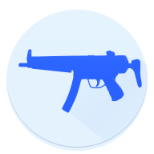

# UnCSO2

[](https://raw.githubusercontent.com/harmonytf/UnCSO2/master/COPYING)

[](https://github.com/harmonytf/UnCSO2/releases/latest)
[](https://aur.archlinux.org/packages/uncso2-bin)
[](https://flathub.org/apps/tf.harmony.UnCSO2)



A file data extractor for the video games Counter Strike: Online 2 and Titanfall Online, for Windows and GNU/Linux.

It uses ekey's reversing work published at [XeNTaX's forums](https://forum.xentax.com/viewtopic.php?f=21&t=11117).

This program's layout is based off KDE's Ark.

It uses [libuncso2](https://github.com/harmonytf/libuncso2) as the back-end library.

## Download

You may download the latest build of UnCSO2 here: [Releases](https://github.com/harmonytf/UnCSO2/releases/latest).

Linux version is also available on [FlatHub](https://flathub.org/apps/tf.harmony.UnCSO2).

## Features

Aside from extracting files from Counter-Strike: Online 2's and Titanfall Online's proprietary archive format, PKG, UnCSO2 can:

- Explore and extract from individual PKG archives
- Explore and extract from entire game's filesystem (loads every PKG archive in their PKG index)
- Preview and/or extract individual file entries
- Decrypt Counter-Strike: Online 2 files with an `.e*` prepended in their extension
- Decompress Counter-Strike: Online 2 texture files

### Compatible CSO2 regions

UnCSO2 **supports every Counter-Strike: Online 2 region**'s game data.

Those regions are: South Korea, China, Taiwan and Japan.

## Building

### Requirements

- [CMake](https://cmake.org/download/) (must be in PATH)
- [Qt 6.10](https://www.qt.io/download)
- A C++20 compiler

#### With Visual Studio (new way)

Visual Studio nowadays has built-in integration for CMake projects.

1. File → Open → CMake... → Select CMakeLists.txt

2. Build → Build All

You should have the extension Qt Visual Studio Tools installed. It will prompt you to import your Qt install path upon installation, select required Qt version as the default.

#### With Visual Studio (old way)

The old way is to generate project files (sln, vcxproj).

You can generate project files for Visual Studio by running the following commands:

```sh
# Create and go to the build directory
mkdir build
cd build

# Generate project files
cmake -G "Visual Studio 17 2022" -A "x64" ../
```

You can then build the solution file `uc2.sln`.

#### With other compilers

You can use the following the command to generate Ninja files for your compiler:

(With GCC as example)

```sh
# Create and go to the build directory
mkdir build
cd build

# Generate ninja files
cmake -G "Ninja" \
        -DCMAKE_CXX_COMPILER="g++" \
        -DCMAKE_C_COMPILER="gcc" \
        -DCMAKE_BUILD_TYPE="RelWithDebInfo" \
        ../

# To build the project
ninja all
```

#### Flatpak build

```sh
flatpak run --command=flathub-build org.flatpak.Builder --install tf.harmony.UnCSO2.yml
```

Lint:

```sh
flatpak run --command=flatpak-builder-lint org.flatpak.Builder manifest tf.harmony.UnCSO2.yml
flatpak run --command=flatpak-builder-lint org.flatpak.Builder repo repo
```

Single-file bundle (for sharing a dev build):

```sh
flatpak build-bundle repo UnCSO2.flatpak tf.harmony.UnCSO2 --runtime-repo=https://flathub.org/repo/flathub.flatpakrepo
```

More information: <https://docs.flatpak.org/en/latest/first-build.html>

#### Arch Linux build

Assuming you cloned to a dir named `UnCSO2`...

```sh
paru -Bi .
```

## Libraries used

UnCSO2 uses the following libraries:

- [GSL Lite](https://github.com/martinmoene/gsl-lite), MIT license.
- [Breeze Icon Theme](https://cgit.kde.org/breeze-icons.git/), LGPL.

libuncso2 also depends on libraries, see [libuncso2's used libraries](https://github.com/harmonytf/libuncso2/blob/master/README.md#libraries-used) for more information.

## License

UnCSO2 is distributed under the GNU GPLv3 license.

In the previous 1.* versions, UnCSO2 is distributed under the MIT license.
